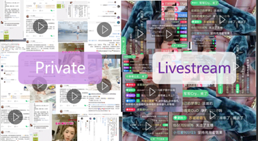
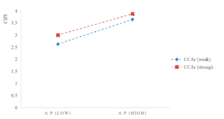
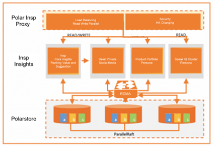
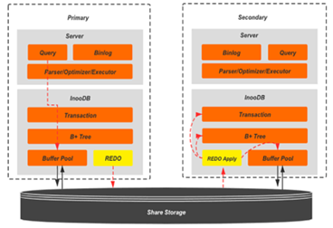

Insp: The livestreaming aid which help livestreamers to know who speak, what to speak and what to sell to grow the CLTV, GMV and fanbase

# Background: 
The use of livestreaming has grown greatly recently due to changes in consumer habits and behaviour. It is commonly used for gaming, entertainment education and But due to the nature of intermingling between the private and public social media spheres it is  where it is difficult to know
- Who should be interacted with for maximum CLTV ( i.e. Whales vs Freeloaders)
- What to say at the period of time to gather most interact(Interest, Hook, Retain, Convert and Advance)
- What to sell and do at the point of time to gather maximum conversion and enhancement of relationships(The current schedule of products is determined by commercial order and loudest person in the room)

*Figure 1: Strong association between buying intention and effective communication*

The ability to do this well makes is requires much training as well as experience to be able to do so, however even with training and experience, it is challenging to do so well due to the messages which are present and the number of fans which might be present.

This is especially difficult for normal databases due to the livestreaming context at which there is a network latency and huge changes in traffic and many different factors to be stored. To be able to solve this problem, the team worked on the use of PolarDB to tackle the challenges of   working with large amounts of data, and has the capabilities of high concurrency, high availability and strong elastic scalability.

Insp: Using real-time low latency Small and Big Data enabled by PolarDB to help livestreamers to speak , and sell more effectively and increase the audience CLTV and GMV

Features of Product
**Audience View**: Livestreamers have a limited time and energy and focus to communicate with a vast number of  users. Effective communication boosts engagement and unlocks additional levels of CLTV. Hence it is important for livestreamers to direct their messages and attention at users with higher CLTV.

The audience view component of the Inspi:
- Collates the critical habit loop inducing/reinforcing action of the users to bring to the attention of the livestreamers, aiding them utilise behavioural actions within their session.
- Calculates the CLTV potential users and summarises previous private and public social media  interactions allowing rapport to be build and enhanced more effectively.
- Visualises the audience view of the livestreamers and provides troubleshooting aid when possible to ensure that the best experience is offered to user.

**Speak IQ**: From our team experience, the right content will help improve the attention and lead to more conversion for users. Currently most the content is scripted or based on the feel of livestreamers, this makes it a hit or miss

To aid livestreamers , Inspi uses the user persona of the users present to
- Provide seed topics which are liked by the current users
- Games and prop suggestions to spike the interest of the users
- Uses Alicloud NLP to collate multiple questions for the  livetreamers and use GPT3 to provide suggestions to answer the customers

**Sell IQ**: Currently, most of the product introduction is made on a fixed basis or “Loudest person in the room

# Modular/API Connections: 
## PolarDB X Insp: Providing low latency concurrent high impact usable insights

**Speed through Read-Write**: separation Insp requires speedy provision of insights it uses PolarDB to provide a cluster address for  read and write consistency, some read and write transactions are automatically distributed to the master-slave database, and the load-based automatic scheduling strategy is automatically scheduled according to the number of active connections to achieve multiple load balancing among nodes increasing the QPS available. 

Data Consistency in critical conditions

**Traffic Spikes during Live-streams adding of slave nodes**: Livestreams are characterized by spikes in volume, Polardb allows speedy adding slaves during short term stochastic needs The presence of the RDMA traffic distribution also helps to skip the OS buffering which is needed for most SQL systems. 

**Faster adding Feature based data(innodb_support_instant_add_column)**: The instant algorithm makes it no longer necessary to rebuild the entire table when adding columns. It only needs to obtain the MDL lock briefly and record the basic information of the newly added columns in the metadata of the table. For indexing, PolarDB supports parallel DDL and DDL physical copy optimization functions.

*Figure 2: PolarDb instant Algorithmn ensures provides sample case where red is the improvement*

## Other AliCloud Products used
Alicloud PAI: For algorithm development, training and deployment
Alicloud OCR: Recognition of content during Product Portfolio input and enhancement 
Alicloud AiREC: Enhanced Opposite side recommendation engine 
Alicloud NLP: For natural language understanding
…( Contact team if more information is needed)

# References/Appendix
Research on the influence mechanism of anchors’ professionalism on consumers’ impulse buying intention in the livestream shopping scenario 2022 Liu Et al

Transparentizing the “Black Box” of Live Streaming: Impacts of Live Interactivity on Viewers’ Experience and Purchase Wu et al 2022

Reimagining “gamers” via Twitch platform tools Garvey 2023

Max Sjöblom, Juho Hamari. (2017). Why do people watch others play video games? An empirical study on the motivations of Twitch users [J]. Computers in Human Behavior, 2017(10): 985-996.

Sheila C. Murphy. (2004). 'Live in Your World, Play in Ours': The Spaces of Video Game Identity [J]. Journal of Visual Culture, 2004(8): 223-238.

Wu Mengting. (2016). Analyzing the phenomenon of celebrity live streaming from the perspective of use and satisfaction theory [J]. Radio & TV Journal, 2016, (12): 89-90.

Xu Weiyi. (2016). Analysis of the psychological characteristics of audiences on streaming platforms [J]. Journal of News Research, 2016, (18): 10-13.

Zhang Shiyao. (2017). A Study on the Motivation of Streaming Usage [D]. Zhengzhou: Zhengzhou University, 2017.
Analysis on the Motivation of Live Game Streaming Audience—Taking League of Legends Live Streaming as an Example Wu

Impacts of Live Commerce Towards Purchase Intention Among Malaysia Adults Sim et al 2023

The effect of E-commerce virtual live streamer socialness on consumers' experiential value: an empirical study based on Chinese E-commerce live streaming studios Wu et al
